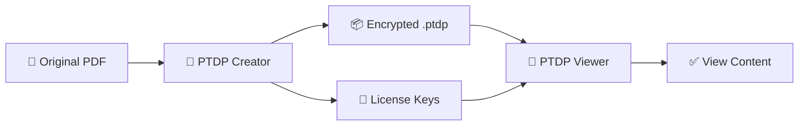

<p align="center">
  
</p>

<h1 align="center">🔒 PTDP Protection System</h1>

<p align="center">
  <strong>Protect Your Digital Products with Military-Grade Encryption</strong>
</p>

<p align="center">
  <a href="https://github.com/USERNAME/PTDP-Protection/actions">
    
  </a>
  <a href="https://github.com/USERNAME/PTDP-Protection/releases/latest">
    
  </a>
  <a href="https://github.com/USERNAME/PTDP-Protection/blob/main/LICENSE">
    
  </a>
  <a href="https://github.com/USERNAME/PTDP-Protection/releases">
    
  </a>
</p>

<p align="center">
  <a href="#-quick-start">Quick Start</a> •
  <a href="#-features">Features</a> •
  <a href="#-download">Download</a> •
  <a href="#-documentation">Docs</a> •
  <a href="#-faq">FAQ</a>
</p>

---

## 🎯 What is PTDP?

**PTDP (Protected Digital Product)** is a custom file format (`.ptdp`) designed to protect digital products like ebooks, courses, templates, and premium content with enterprise-level security.

<table>
<tr>
<td width="50%">

### 🛡️ For Sellers
Protect your digital products from piracy. Create encrypted files that can only be opened with valid license keys.

</td>
<td width="50%">

### 📖 For Buyers  
Securely read protected content. One-click download, enter your license key, and enjoy!

</td>
</tr>
</table>

---

## ✨ Features

| Feature | Description |
|---------|-------------|
| 🔐 **AES-256 Encryption** | Military-grade encryption for your content |
| 🔑 **License System** | Unique keys for each customer |
| 💻 **Hardware Lock** | Bind license to specific devices |
| ⏰ **Expiry Date** | Set content expiration |
| 👁️ **View Limit** | Control how many times content can be viewed |
| 🔄 **Auto-Update** | Apps automatically check for updates |
| 📖 **In-App PDF Reader** | Secure PDF viewing with anti-screenshot |
| 🎨 **Modern UI** | Beautiful dark theme interface |

---

## 📥 Download

<table>
<tr>
<td align="center" width="50%">
<h3>📖 PTDP Viewer</h3>
<p><em>For Buyers - Read protected content</em></p>
<a href="https://github.com/USERNAME/PTDP-Protection/releases/latest/download/PTDP-Viewer-Windows.exe">

</a>
</td>
<td align="center" width="50%">
<h3>🔐 PTDP Creator</h3>
<p><em>For Sellers - Protect your products</em></p>
<a href="https://github.com/USERNAME/PTDP-Protection/releases/latest/download/PTDP-Creator-Windows.exe">

</a>
</td>
</tr>
</table>

> ⚠️ **First Run:** Windows may show SmartScreen warning. Click **"More info"** → **"Run anyway"**

---

## 🚀 Quick Start

### For Buyers (Reading Protected Files)

```
1. Download PTDP-Viewer-Windows.exe
2. Double-click to run (no installation needed!)
3. Open .ptdp file
4. Enter your license key
5. Enjoy your content! 📖
```

### For Sellers (Creating Protected Files)

```
1. Download PTDP-Creator-Windows.exe
2. Double-click to run
3. Select PDF file to protect
4. Configure protection settings
5. Generate license keys for customers
6. Distribute .ptdp file + license keys
```

---

## 🔧 How It Works



<details>
<summary>📋 <strong>Technical Details</strong></summary>

### Encryption Process
1. PDF content is encrypted using AES-256
2. Encryption key derived from `product_id + secret_key` via PBKDF2
3. Metadata (product info, restrictions) stored in file header
4. License validation checks hardware ID, expiry, view count

### Security Features
- **Anti-Screenshot**: Windows Display Affinity protection
- **Anti-Copy**: Keyboard shortcuts disabled in viewer
- **Hardware Binding**: License tied to specific machine
- **Expiry Control**: Time-based license expiration

</details>

---

## 📁 Project Structure

```
PTDP-Protection/
├── 📁 core/                 # Core modules
│   ├── creator.py          # File encryption
│   ├── reader.py           # File decryption
│   ├── license.py          # License validation
│   ├── hwid.py             # Hardware ID detection
│   └── updater.py          # Auto-update system
├── 📁 gui/                  # GUI applications
│   ├── viewer_modern.py    # Secure PDF viewer
│   └── creator_modern.py   # Creator interface
├── 📁 assets/               # Icons & resources
│   └── icons/              # App icons
├── 📁 website/              # Landing page
├── config.py               # Configuration
├── requirements.txt        # Dependencies
├── viewer.py               # Viewer entry point
└── creator.py              # Creator entry point
```

---

## 📖 Documentation

| Document | Description |
|----------|-------------|
| [📘 Quick Start](QUICKSTART.md) | Get started in 5 minutes |
| [📗 User Guide](USER_GUIDE.md) | Complete usage instructions |
| [📕 Developer Guide](DEVELOPER_GUIDE.md) | API & integration docs |

---

## ❓ FAQ

<details>
<summary><strong>Why does Windows show a warning?</strong></summary>

Windows SmartScreen shows warnings for unsigned applications. To remove this warning, the app needs a code signing certificate ($200-400/year). The app is completely safe - you can verify by checking the source code.

**Workaround:** Click "More info" → "Run anyway"
</details>

<details>
<summary><strong>Can I use one license on multiple devices?</strong></summary>

By default, licenses are bound to one device. Sellers can configure multi-device licenses using the `ANYDEVIC` option in Creator.
</details>

<details>
<summary><strong>What happens when license expires?</strong></summary>

The viewer will show an "Expired License" message. Users need to contact the seller for renewal.
</details>

<details>
<summary><strong>Is my content safe from piracy?</strong></summary>

PTDP uses AES-256 encryption (same as banks and military). While no protection is 100% unbreakable, PTDP makes piracy significantly more difficult than distributing plain PDFs.
</details>

---

## 🛠️ Development

```bash
# Clone repository
git clone https://github.com/USERNAME/PTDP-Protection.git
cd PTDP-Protection

# Install dependencies
pip install -r requirements.txt

# Run tests
python -m pytest tests/

# Run viewer
python viewer.py

# Run creator
python creator.py
```

---

## 📜 License

This project is licensed under the MIT License - see the [LICENSE](LICENSE) file for details.

---

<p align="center">
  <strong>Made with ❤️ for Content Creators</strong>
</p>

<p align="center">
  <a href="https://github.com/USERNAME/PTDP-Protection">
    
  </a>
  <a href="https://github.com/USERNAME/PTDP-Protection/fork">
    
  </a>
</p>
